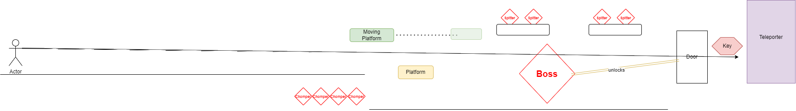

# COMP2150  - Level Design Document
### Name: Kyle Hubbard
### Student number: 47435356

## 1. Player Experience (~700 words)

The player begins with two pathways, one to the right and one to the left. The left path is blocked, subtly guiding the player towards the cave area on the right.  The initial focus is comfortable movement, reinforced by an acid pit challenge. Next, a pressure plate demonstrates interactable elements; stepping on the plate opens a door ahead. Once inside, the player acquires a gun and pistol and encounters a split pathway. Below, a destructible pillar stands amidst a swarm of enemies. Above, spikes and chompers provide obstacles. This split encourages exploration of both routes. At the cave's end, shooting a switch opens the bridge that previously blocked the other pathway.

The alternate pathway involves climbing a cliff and leaping to a floating island where the player encounters a new enemy type: the spitter. This section eases the player into understanding this enemy's behavior. The only true test lies at the end, where a moving platform and a spitter guard the goal.

The second section adopts a spiral discovery pattern, restricting player movement in a guided fashion. The emphasis here is on drama and the challenge of dodging and maneuvering while attacking.  The player's expectations are set with a timed jump challenge over an acid pit. Afterward, they descend to a checkpoint followed by a large spike pit traversed via a moving platform. Floating spike islands and spitters strategically placed along the platform's path significantly ramp up the difficulty, forcing the player to target enemies while dodging obstacles.

The final part is a central area with two pathways that must be completed in any order to drop a pushable box onto a pressure plate, unlocking the door to the next stage. While less focused on drama, this discovery-driven segment still challenges the player's quick reflexes and threat response.

The final section begins with deceptive simplicity: an empty room with a platform and a closed door to the left. This creates low initial tension. Moving right reveals an obstacle, followed by a cutscene unveiling a boss behind the door.  The tension peaks as the boss health bar appears, signaling the player must defeat this formidable foe to advance. The boss battle has three stages of increasing difficulty.  Stage one introduces moving spike platforms, ensuring the player can't solely rely on the safety of the floating platforms. Stage two adds chompers that spawn regularly, forcing the player to split their focus.  The final stage grants more health regeneration for the player but pits them against floating platforms with spitters.

## 2. Core Gameplay (~400 words)

### 2.2. Checkpoints
I chose to include checkpoints because they act as vital moments of respite and accomplishment. A well-placed checkpoint breathes life back into the player after a hard-fought battle, letting them know they're on the right track and can push on without fear of complete setbacks.

### 2.1. Acid
acid makes a a secondary obstacle because it forces precise, considered movement. It's a constant reminder that every platforming decision matters, turning what might be standard traversal into a test of skill and timing.

### 2.8. Spikes
I chose to incorporate spikes because they add an element of ever-present danger. Unlike acid, they are often dynamic, moving in patterns and demanding constant player awareness. This adds another layer of complexity and keeps players on their toes even when navigating familiar patterns.

### 2.4. Health Pickups
I chose health pickups because they represent moments of relief and the possibility of overcoming even the most difficult encounters. Strategically placing them after tough sequences gives the player a boost of confidence and the motivation to push forward.

### 2.10. Weapon Pickup (Gun) / (Staff)
I chose health pickups because they represent moments of relief and the possibility of overcoming even the most difficult encounters. Strategically placing them after tough sequences gives the player a boost of confidence and the motivation to push forward.

### 2.3. Chompers
I chose to introduce chompers early because they're a simple obstacle that teaches the player important concepts. Their predictable behavior lets players focus on timing and movement fundamentals and prepares them for more complex encounters later on.

### 2.7. Passthrough Platforms
I chose passthrough platforms because they add a unique verticality element to level design. They encourage players to think beyond just left-and-right movement and consider creative ways to solve spatial puzzles.

### 2.9. Spitters
I chose to use spitters because they force awareness and strategic movement.  Their ranged attacks restrict the player's  freedom, acting as guides to propel them along a specific path while adding another layer of danger to the environment.

### 2.6. Moving Platforms
I chose moving platforms because they add dynamism and break up the pace of a level.  They present scenarios where players have to navigate confined spaces or make well-timed leaps, building upon their previously acquired skills in a new way.

### 2.5. Keys
keys play a limited role and are useally put at the end of the stages.

## 3. Spatiotemporal Design
 
### 3.1. Molecule Diagram

### 3.2. Level Map – Section 1

### 3.3.	Level Map – Section 2

### 3.4.	Level Map – Section 3

## 4. Iterative Design (~400 words)

I employed an iterative design approach to significantly rework elements of the 2nd and 3rd stages in my game. Here's how the process unfolded:

Stage 2 Adjustments

Initial playtesting of stage 2 revealed that spitters positioned in the center section could fire through the tilemap, drastically altering gameplay and making the section unfairly difficult. My first iterative change was to adjust the spitters' lines of sight to prevent them from seeing the player within the corridor.  However, further playtesting showed that the spitters were reluctant to move along the flat central area. To address this, I removed the spitters and increased the number of chompers.

Stage 3 Revisions

Stage 3 underwent the most extensive iterative changes, primarily focused on the boss fight. Initially, the moving spike trap hovered too far over the platform, negating its intended purpose. Additionally, the platform could damage the player during health retreats. My initial design hadn't anticipated the obstructive nature of the platform, leading to a frustrating rather than challenging experience. I decreased the platform's range and size to prevent unintended player hits.

Next, I originally had chompers spawning on the right, but they became stuck on the boss and didn't meaningfully contribute to the fight.  Moving their spawn point to the left created a new issue where they could immediately hit the player upon appearing. To mitigate this, I carved a section out of the map, forcing them to travel further. This gives the player crucial reaction time and signals the chomper spawn.

Finally, stage 3 featured spitter enemies that added difficulty. I had platforms on both the left and right of the boss, but playtesting revealed that the right platform was impossible to hit. I relocated it above the health crates on the left, allowing players to target spitters more effectively and creating a more balanced level.

Conclusion and Future Refinements

These changes significantly improved playability, but there's always room for refinement. One notable issue in the stage 3 boss fight is that the confined space prevents the boss from using its third attack. Addressing this would enhance the challenge and excitement of the final stage.

